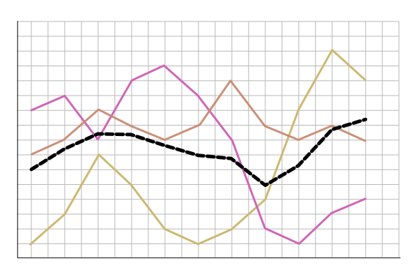
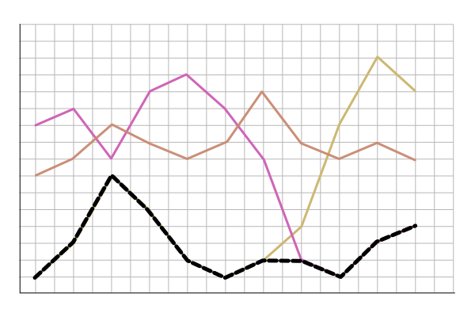
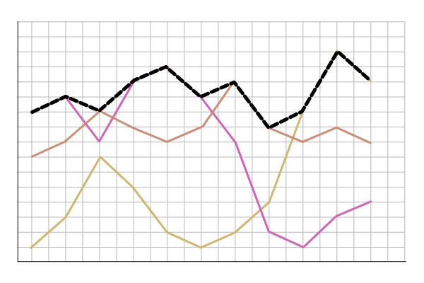

# Aggregations

Time series can be very dense, assuming that you have a system that emits one
metric every second.
After one hour you will have `3600` datapoints, after a day these will be
`86400`.

If you have 10 hosts emitting these you end up with `864000`, you are rapidly
approaching a point where most visualization systems will start to stagger in
just displaying all of this data.

Aggregations solve this by applying functions to the `raw` data, and outputting 
an aggregated time series which have a much lower density than the original.

In heroic, aggregations are specified at query time. All aggregations happen on
the fly, the result of which can be temporarily cached for better performance.

## Aggregation Methods

### Average

For each sampling, sums all the samples and divides by their count, giving an
average.

Averages are useful as a default aggregation because they give a fair estimate
of the trends in the underlying time series.

Average does however have a tendency to disguise outliers, which is why you
might pick another type of aggregation.

### Min

For each sampling, picks the smallest numerical value.

### Max

For each sampling, picks the largest numerical value.

### Per-Group (Group By)

Per-Group is a special type of aggregation which performs a group-by of
a specific set of tags, and then aggregates each group using the given
aggregation.
