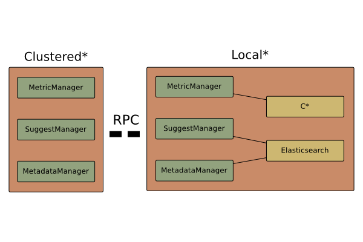

# Architecture

This project uses Dependency Injection for configuration management, and most
internal components uses a future-based API (see [Futures](#futures)).

Heroic works as a cluster of nodes.
These are generally grouped into the following, distinct roles.

* API Nodes
* Query Nodes
* Write Nodes

The API nodes are responsible for receiving end-user requests, dispatching
these to the appropriate Query nodes, and merge the result for the user.

_Query nodes_ are responsible for processing requests received over RPC.

_Write nodes_ are responsible for writing (alt. consuming, ingesting) data into
the cluster.
They may coordinate among eachother to figure out who is most suitable to
handle a write.

## Internal Architecture



The internal API of each node is dividied into the following components.

* Metric, which drives the fetching and aggregation of metrics.
 * Source:
   [Clustered](/heroic-core/src/main/java/com/spotify/heroic/metric/CoreClusteredMetricManager.java)
   ([clustered interface](/heroic-component/src/main/java/com/spotify/heroic/metric/ClusteredMetricManager.java))
   [Local](/heroic-core/src/main/java/com/spotify/heroic/metric/LocalMetricManager.java)
   ([backend interface](/heroic-component/src/main/java/com/spotify/heroic/metric/MetricBackend.java))
* Metadata, which resolves queries into a set of time series.
 * Source:
   [Clustered](/heroic-core/src/main/java/com/spotify/heroic/metadata/ClusteredMetadataManager.java)
   (no interface)
   [Local](/heroic-core/src/main/java/com/spotify/heroic/metadata/LocalMetadataManager.java)
   ([backend interface](/heroic-component/src/main/java/com/spotify/heroic/metadata/MetadataBackend.java))
* Suggest, which provides users with typeahead suggestions.
 * Source:
   [Clustered](/heroic-core/src/main/java/com/spotify/heroic/suggest/ClusteredSuggestManager.java) 
   (no interface)
   [Local](/heroic-core/src/main/java/com/spotify/heroic/suggests/LocalSuggestManager.java)
   ([backend interface](/heroic-component/src/main/java/com/spotify/heroic/suggest/SuggestBackend.java))

Each component above have a _clustered_, and a _local_ implementation.

Performing a request over the _clustered_ implementation causes the request to
fan out over the cluster, query each individual shard, and merge the result.

Performing a request over the _local_ implementation interacts directly with
the configured backend.

Most of the local managers extend
[GroupManager](/heroic-component/src/main/java/com/spotify/heroic/utils/GroupManager.java),
which is an interface describing how the manager exposes
[backend groups](#backend-groups).

### Example 1: A component using a clustered manager to perform a request

```java
import java.util.concurrent.TimeUnit;

import lombok.extern.slf4j.Slf4j;

import com.google.inject.Inject;
import com.spotify.heroic.filter.Filter;
import com.spotify.heroic.filter.FilterFactory;
import com.spotify.heroic.metadata.ClusteredMetadataManager;
import com.spotify.heroic.metadata.model.FindSeries;
import com.spotify.heroic.model.DateRange;
import com.spotify.heroic.model.RangeFilter;

import eu.toolchain.async.AsyncFuture;
import eu.toolchain.async.Transform;

@Slf4j
class MyAwesomeComponent {
    @Inject
    protected ClusteredMetadataManager metadata;

    @Inject
    protected FilterFactory filters;

    public AsyncFuture<Void> findSomeAccesspoints() {
        final long now = System.currentTimeMillis();
        final long then = now - TimeUnit.MILLISECONDS.convert(1, TimeUnit.HOURS);

        final DateRange range = new DateRange(then, now);

        final Filter filter = filters.matchTag("role", "accesspoint");

        final RangeFilter rangeFilter = RangeFilter.filterFor(filter, range);

        /**
         * {@code null} causes it to use the default backend group.
         */
        return metadata.findSeries(null, rangeFilter).transform(new Transform<FindSeries, Void>() {
            public Void transform(FindSeries series) {
                log.info("Found {} series(s) with role accesspoint", series.getSize());
                return null;
            }
        });
    }
}
```

## Backend Groups

Backend Groups is a concept invented when we were migrating from one database scheme to another.

Each backend specifies which group(s) it belongs to in configuration, and when interacting with the corresponding manager, you will also specify which groups should be used.

There is also a _default group_ that is used when no group is specified.

### Example 1: Schema Migration

The old database scheme was implemented and used as the group `v1`, and the new database scheme was implemented as a new type of backend, and used as the group `v2`.
Since data migration takes time we started redirecting writes to a group specifying both `v1` and `v2`, but we kept reads to only use the `v1` group.
When data migration was completed we simply swapped the read group to a new group that only contained `v2`.

This keeps configuration drift to a minimum, since this is a change that can be performed with very little actual change. It also allows us to verify that the `v2` scheme _works_ in production, before we make the complete switch.

This change can also be rapidly reverted if any problems arise, by switching back to read from group `v1`.

# Futures

When reading through the code you will undoubtedly encounter `AsyncFuture<T>`.
`AsyncFuture` is an extended type of future.

Futures allows the implementation of the API to defer execution until a later
point without having to block the thread that invokes it, this grants the API
to choose how and when it should process the request.

Shallowly it might look strange that most API's are defined using futures, but
the benefits are significant.

* Writing customized concurrent code for each specific case that requires it
  would require specialized interaction.
* It might not immediately be apparent which parts of your application requires
  concurrency, or some other specialized method of execution. The API
  interaction is the same regardless.
* Bridging synchronous, and concurrent execution is cumbersome and error prone.
* Async code makes better use of thread pools since they are oppurtunistic, and
  do not block while a computation is processing.

# Dependency Injection

We use Guava, this offers much initialization code than non DI alternatives.

We utilize hierarchical dependency injectors, so that different subsystems have
access to the same root injector, but isolates their specific dependencies.
This avoids issues with too much crud in the same injector.

Things that are useful across the entire application live in the primary
injector.

# Learning Resources

* [TinyAsync](http://github.com/udoprog/tiny-async-java)
* [Video Describing DI (specifically, development into Dagger2)](

